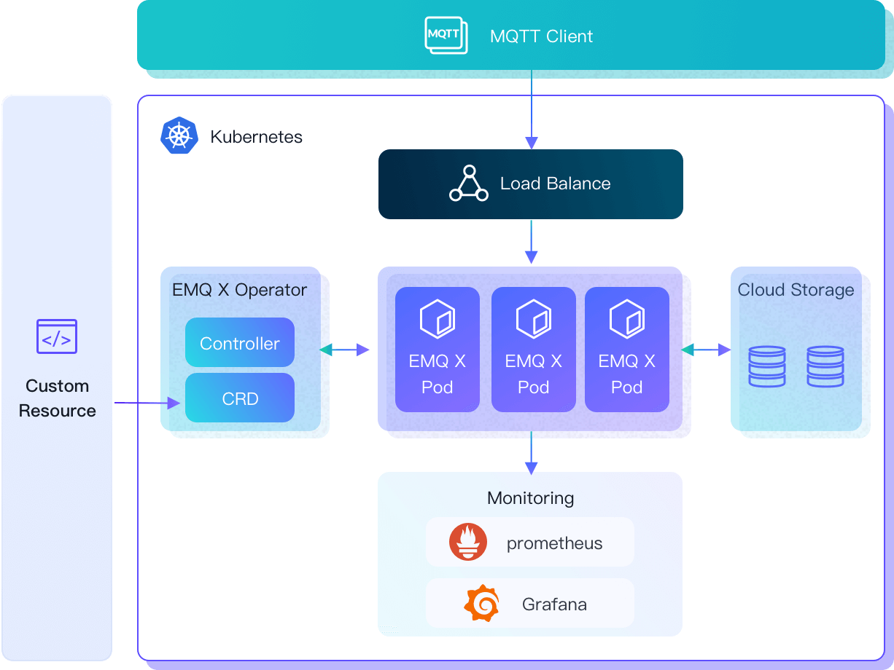

## EMQ X Operator introduction

EMQ X Enterprise is a cloud-native MQTT broker. EMQ X Kubernetes Operator is a new way to create and manage cloud-native EMQ X Enterprise instances based on Kubernetes architectures. It simplifies the process and required knowledge of the deployment and management.

## EMQ X operator architecture
